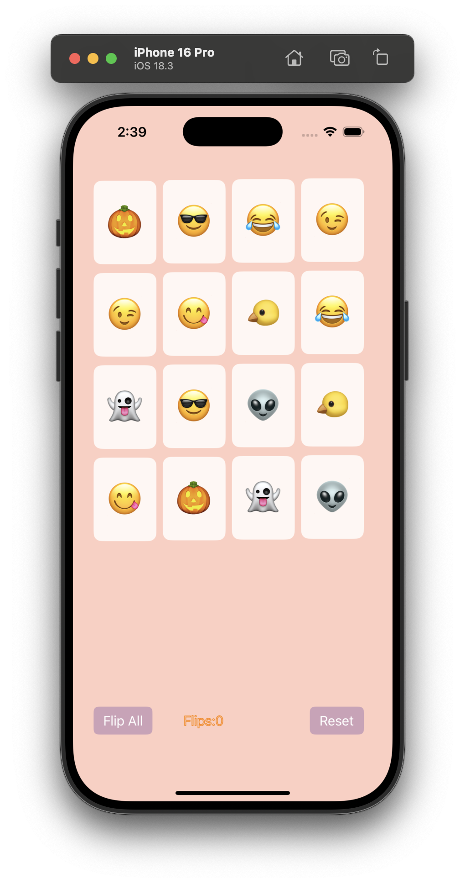

# Card Matching Game
> [!NOTE]  
> This README.md file was generated with the assistance of AI to provide a clear and concise overview of the Card Matching Game project.  

## Features

- **Card Matching Logic**: Players can flip cards to find matching pairs.
- **Flip Count**: Tracks the number of flips made by the player.
- **Reset Functionality**: Players can reset the game to shuffle the cards and start over.
- **Flip All Cards**: A feature that reveals all cards at once, but disables further interaction until they are flipped back down.
- **Dynamic Emoji Assignment**: Randomly assigns emojis to cards for each game session, ensuring a unique experience every time.
- **Game Continuation**: When all cards are face-down, the game continues as normal. If all cards are face-up, no further actions can be performed.

## How to Play

1. **Flip a Card**: Tap on any card to flip it over and reveal the emoji.
2. **Find a Match**: Tap on another card to try and find its matching pair.
3. **Matching Pairs**: If the two cards match, they will stay face-up. If not, they will flip back after a brief delay.
4. **Complete the Game**: Continue flipping cards until all pairs are matched.
5. **Reset the Game**: Use the "Reset" button to shuffle the cards and start a new game.

## Screenshots and Demo

Here are some visuals and a demo showcasing the game:

- **Main Screen**: The initial view of the game.  
    

- **Flip All Feature**: Reveals all cards at once.  
    

- **Random Emoji After Reset**: Demonstrates the dynamic emoji assignment after resetting the game.  
    

- **Gameplay Demo**: Watch the game in action.  
    <div align="center">
        <video src="Simulator%20Screen%20Recording%20-%20iPhone%2016%20Pro%20-%202025-04-01%20at%2014.45.53.mp4" controls width="600"></video>
    </div>

## Installation

1. Clone this repository:
   ```bash
   git clone <repository-url>
   ```
2. Open the project in Xcode:
   ```bash
   open Card\ Matching\ Game/Card\ Matching\ Game.xcodeproj
   ```
3. Build and run the app on a simulator or a physical device.

## Project Structure

- **`ViewController.swift`**: Handles the UI and game logic.
- **`MatchingGame.swift`**: Contains the core logic for managing the cards and matching pairs.
- **`Card.swift`**: Defines the `Card` struct used in the game.
- **`Main.storyboard`**: Defines the UI layout of the game.
- **`Assets.xcassets`**: Contains the app's assets, including the app icon and accent colors.

## Requirements

- iOS 13.0 or later
- Xcode 14.0 or later
- Swift 5.0

## Development

1. Modify the `MatchingGame` class for game logic changes.
2. Update the `ViewController` for UI-related changes.
3. Use the storyboard to adjust the layout or add new UI elements.

## Author

- **張睿恩** - Created on 2025/4/1
